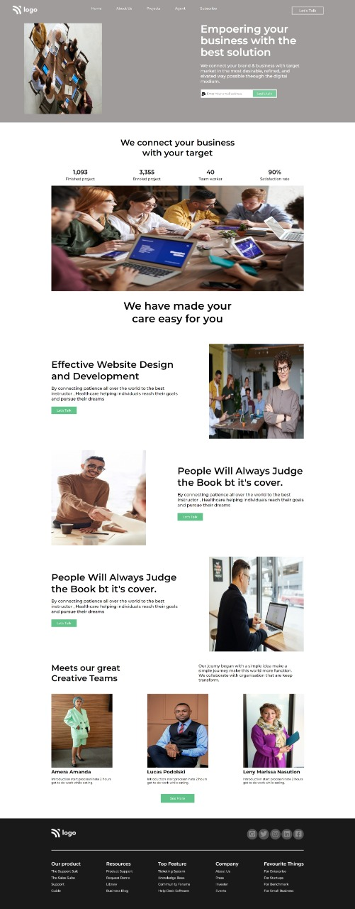

# Project-12-  A Service Provider Company Website Template.
 ## Hey there ,  I am Amarjeet 
 I have built a template of HTML and CSS project using my core css skills.
 
 
 
 

 My Live Deployed Website Link:- [Click here!]()

 
 

 ## For making this project I spend almost 5 hours.

 ## What I learned from this project 
 - Most important thing which I learned from this project is about position.
 - also I explore about input .
  - How to add logo like twitter , instagram , facebook , github etc on my web page.
  - Also I explore more about flex box and its property.
